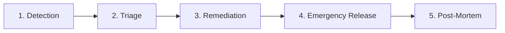

# Регламент реагирования на инциденты DashFlow (Incident Response Plan)

**Дата создания:** 30 сентября 2026  
**Версия:** 1.0.0  
**Статус:** Production Ready  
**Область действия:** Браузерное расширение DashFlow (Chrome MV3, Firefox Gecko)

---

## Оглавление

1. [Обзор и принципы](#обзор-и-принципы)
2. [Классификация серьезности инцидентов (Severity Levels)](#классификация-серьезности-инцидентов-severity-levels)
3. [Роли и зоны ответственности](#роли-и-зоны-ответственности)
4. [Фазы реагирования на инцидент](#фазы-реагирования-на-инцидент)
   - [Фаза 1: Обнаружение (Detection)](#фаза-1-обнаружение-detection)
   - [Фаза 2: Классификация и сдерживание (Triage & Containment)](#фаза-2-классификация-и-сдерживание-triage--containment)
   - [Фаза 3: Локализация и исправление (Remediation)](#фаза-3-локализация-и-исправление-remediation)
   - [Фаза 4: Экстренный релиз и верификация (Release & Verification)](#фаза-4-экстренный-релиз-и-верификация-release--verification)
   - [Фаза 5: Разбор инцидента (Post-Mortem)](#фаза-5-разбор-инцидента-post-mortem)
5. [Экстренные сценарии и Runbooks](#экстренные-сценарии-и-runbooks)
   - [Сценарий A: Потеря пользовательских данных / сбой миграции](#сценарий-a-потеря-пользовательских-данных--сбой-миграции)
   - [Сценарий B: Критическая уязвимость безопасности / XSS / CSP bypass](#сценарий-b-критическая-уязвимость-безопасности--xss--csp-bypass)
   - [Сценарий C: Массовый отказ внешнего API (Open-Meteo, Geocoding)](#сценарий-c-массовый-отказ-внешнего-api-open-meteo-geocoding)
   - [Сценарий D: Отклонение или удаление расширения из Chrome Web Store / Firefox AMO](#сценарий-d-отклонение-или-удаление-расширения-из-chrome-web-store--firefox-amo)
6. [Шаблоны коммуникации и уведомлений](#шаблоны-коммуникации-и-уведомлений)

---

## 1. Обзор и принципы

DashFlow является локальным браузерным расширением с архитектурой **Privacy by Design** (все пользовательские данные хранятся в `chrome.storage.local`, удаленная телеметрия отсутствует).

Специфика инцидент-менеджмента для браузерного расширения:
- **Нет прямого доступа к продакшн-серверам:** Нельзя просто «перезапустить бэкенд» или применить hotfix на сервере за 5 минут.
- **Цикл модерации магазинов:** Любое обновление проходит ревью в Chrome Web Store (от 2 часов до 3 дней) и Mozilla AMO (от 15 минут до суток).
- **Автономность клиентов:** Клиенты должны уметь изолировать сбои самостоятельно (Circuit Breaker, RootErrorBoundary, WidgetErrorBoundary, безопасные fallback-состояния).

### Ключевые принципы:
1. **Безопасность и сохранность данных важнее доступности функций:** При риске повреждения данных компонент должен немедленно деградировать в защищенный режим чтения.
2. **Blameless культура:** Поиск системных причин сбоя, а не виновных лиц.
3. **Прозрачность:** Информирование сообщества в GitHub Issues и Discussions.

---

## 2. Классификация серьезности инцидентов (Severity Levels)

| Уровень | Описание | Примеры | Целевое время реакции (MTTA) | Целевое время решения (MTTR) |
|---|---|---|---|---|
| **SEV-1 (Критический)** | Катастрофический сбой: потеря пользовательских данных, уязвимость безопасности (XSS, утечка), блокировка/удаление из Web Store, белый экран при открытии вкладки у всех пользователей. | - Циклическое падение `main.tsx` при открытии вкладки.<br>- Сбойная миграция очистила хранилище заметок и задач.<br>- Блокировка в Chrome Web Store за нарушение политик. | **< 15 минут** | **< 4 часов (до отправки hotfix в store)** |
| **SEV-2 (Высокий)** | Нарушение работы ключевого функционала у значительной доли пользователей без потери данных: отказ основного виджета, невозможность открыть настройки. | - Circuit Breaker заблокировал погодный виджет у 100% пользователей из-за смены схемы API.<br>- Зависание Command Palette при открытии.<br>- Ошибка сохранения темы. | **< 1 час** | **< 24 часов** |
| **SEV-3 (Средний)** | Незначительный дефект: сбой вспомогательного виджета, редкие артефакты верстки, ошибка локализации, изолированная проблема в одном браузере. | - RSS-виджет не парсит специфический XML-фид.<br>- Звук костра заикается в Firefox на Linux.<br>- Опечатка в тексте ошибки. | **< 8 часов** | **В плановом релизе** |

---

## 3. Роли и зоны ответственности

В период реагирования на SEV-1 / SEV-2 инцидент назначаются следующие роли:

- **Incident Commander (IC):** Координирует процесс, утверждает стратегию сдерживания, принимает решение о выпуске экстренного хотфикса.
- **Technical Lead / Investigator:** Анализирует стек-трейсы, логи из вкладки «Диагностика», воспроизводит баг, разрабатывает патч и регрессионные тесты.
- **Release Engineer:** Прогоняет локальные чеклисты, собирает артефакты через конвейер, подготавливает релизный тег `vX.Y.Z` и загружает пакеты в Chrome Web Store и Mozilla AMO.
- **Communications Lead:** Публикует pinned issue в GitHub, обновляет статус в README/Discussions, готовит ответы на отзывы пользователей в магазинах.

---

## 4. Фазы реагирования на инцидент



### Фаза 1: Обнаружение (Detection)
Источники сигналов об инциденте:
1. **GitHub Issues:** Пользователи прикрепляют отчеты из вкладки `Настройки -> Диагностика и система -> Экспорт отчета`.
2. **Отзывы в Chrome Web Store / Firefox Add-ons:** Резкий всплеск отзывов с 1 звездой.
3. **Внешний мониторинг API:** Уведомления от healthcheck-скриптов о недоступности Open-Meteo или Nominatim.
4. **Служебные письма от Google / Mozilla:** Предупреждения о проверке расширения или несоответствии манифеста.

### Фаза 2: Классификация и сдерживание (Triage & Containment)
1. Создать закрытый инцидент-тред или Issue с меткой `incident:sev-1` / `incident:sev-2`.
2. Оценить масштаб:
   - Затрагивает ли это всех пользователей или определенную версию браузера?
   - Есть ли риск повреждения пользовательских данных в `chrome.storage.local`?
3. **Быстрое сдерживание (Containment):**
   - Если сбой вызван нестабильной функцией, проинструктировать пользователей в GitHub Issue отключить ее через вкладку «Диагностика» -> «Экспериментальные функции» (Feature Flags).
   - Если повреждается хранилище — выпустить минимальный emergency hotfix, переводящий чтение в fallback-режим без повторных попыток перезаписи.

### Фаза 3: Локализация и исправление (Remediation)
1. Локализовать причину сбоя с использованием изолированного репро-теста в `tests/unit/`.
2. Написать юнит-тест, воспроизводящий баг (Red).
3. Применить минимальный, максимально безопасный код исправления (Green).
4. Проверить обратную совместимость данных и схем миграций.
5. Прогнать полную батарею тестов: `npm run validate` (`compile` + `lint` + `test` + `build:all`).

### Фаза 4: Экстренный релиз и верификация (Release & Verification)
1. Поднять patch-версию в `package.json` (например, `3.7.2` -> `3.7.3`).
2. Добавить запись в `docs/CHANGELOG.md` в секцию `[Hotfix]`.
3. Запушить тег `v3.7.3` для запуска `.github/workflows/release.yml`.
4. Получить артефакты `.output/dashflow-3.7.3-chrome.zip` и `firefox.zip`.
5. Загрузить в Chrome Developer Dashboard и AMO Developer Hub с пометкой **«Critical bug fix / Hotfix»** в комментариях для ревьюеров.
6. В Chrome Developer Dashboard запросить ускоренную проверку (Expedited Review), если доступно.

### Фаза 5: Разбор инцидента (Post-Mortem)
В течение 48 часов после завершения инцидента SEV-1/SEV-2 составляется документ разбора.

---

## 5. Экстренные сценарии и Runbooks

### Сценарий A: Потеря пользовательских данных / сбой миграции
**Симптомы:** Пользователи сообщают, что после обновления до новой версии пропали задачи, заметки или слетел дашборд.
**План действий:**
1. Проверить `src/core/storage/` и функцию миграции `dashboardMigrations.ts`.
2. Если миграция бросает исключение, `StorageAdapter` может вернуть `null`.
3. Немедленно проверить, сохранились ли сырые данные в `chrome.storage.local`.
4. Создать патч, который:
   - Делает резервный snapshot сырого JSON перед запуском любой миграции.
   - Если миграция завершилась ошибкой, откатывает схему к предыдущей валидной версии.
   - Выводит пользователю плашку с кнопкой экспорта поврежденного состояния для ручного восстановления.
5. Выпустить hotfix.

### Сценарий B: Критическая уязвимость безопасности / XSS / CSP bypass
**Симптомы:** Обнаружена возможность выполнения произвольного JS-кода через RSS фид, iframe sandbox или CSS injection.
**План действий:**
1. Немедленно идентифицировать точку входа:
   - RSS / HTML parser: `DOMPurify` / `Sanitizer`.
   - Iframe: атрибут `sandbox="allow-scripts"` (убедиться, что `allow-same-origin` отсутствует).
   - Custom CSS: проверка регулярных выражений блокировки `@import` и `javascript:`.
2. Отключить уязвимый компонент по умолчанию в коде расширения.
3. Усилить правила санитизации.
4. Добавить интеграционный тест на эксплойт.
5. Опубликовать патч и зарегистрировать Security Advisory в GitHub.

### Сценарий C: Массовый отказ внешнего API (Open-Meteo, Geocoding)
**Симптомы:** Виджет погоды показывает ошибки, запросы виснут, страница тормозит.
**План действий:**
1. Убедиться, что встроенный **Circuit Breaker** перешел в состояние `OPEN`.
2. Проверить статус аптайма стороннего сервиса (Open-Meteo API Status).
3. Если API изменил контракт или закрылся:
   - Переключить сервис погоды на кэшированные данные `getFallbackWeatherData()`.
   - В UI отобразить статус: «Сервис погоды временно недоступен. Показаны последние сохраненные данные».
   - Не спамить сеть запросами (интервал повторных попыток Circuit Breaker автоматически выставлен на 60 секунд).

### Сценарий D: Отклонение или удаление расширения из магазинов
**Симптомы:** Письмо от Google Chrome Web Store о несоответствии политике (Single Purpose, Permissions, CSP).
**План действий:**
1. Не паниковать и не создавать дубликат расширения в магазине.
2. Внимательно изучить указанный пункт нарушения (обычно это избыточные permissions или неясное описание функционала).
3. Сверить с `docs/COMPLIANCE_CHECKLIST.md`.
4. Если замечание касается разрешений:
   - Проверить, все ли чувствительные разрешения (tabs, storage, alarms) имеют обоснование в `PRIVACY_EN.md` и `manifest.json`.
5. Подготовить ответное письмо ревьюеру с видеозаписью демонстрации функции и ссылками на код.
6. Отправить исправленный билд в течение 48 часов.

---

## 6. Шаблоны коммуникации и уведомлений

### Шаблон 1: Объявление об инциденте в GitHub Issues

```markdown
### ⚠️ [INCIDENT SEV-1/SEV-2] Название проблемы

**Статус:** Исследуется / Готовится исправление / Исправлено в vX.Y.Z  
**Затронутые версии:** v3.7.X  
**Дата инцидента:** ГГГГ-ММ-ДД  

#### Что произошло:
Мы обнаружили проблему, связанную с [краткое описание проблемы].

#### Влияние на пользователей:
[Описать, что может наблюдаться: например, временная недоступность виджета или ошибка отображения].
Пользовательские данные [в безопасности / затронуты / как восстановить].

#### Временное решение для пользователей (Workaround):
1. Откройте «Настройки» (иконка шестеренки внизу экрана).
2. Перейдите во вкладку «Диагностика и система».
3. [Указать действие: отключить флаг X или очистить кэш API].

#### План исправления:
Патч с исправлением подготовлен в PR #XX и отправлен на модерацию в Chrome Web Store и Mozilla AMO. Обновление применится автоматически после одобрения магазинами.
```

### Шаблон 2: Примечание к срочному обновлению (CWS Developer Notes)

```text
URGENT HOTFIX vX.Y.Z:
- Fixed a critical regression affecting widget initialization on browser startup.
- No changes to permissions or user data collection.
- Strict CSP and local-only storage remain unchanged.
- Please expedite review to restore service for active users.
```
