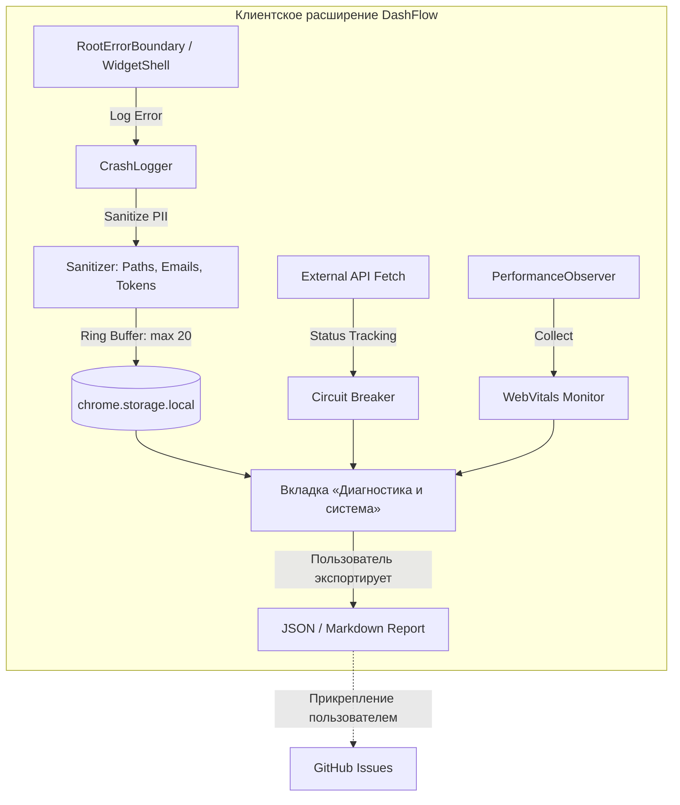

# Мониторинг и наблюдаемость DashFlow

**Дата создания:** 30 сентября 2026  
**Версия:** 1.0.0

---

## Оглавление

1. [Обзор](#обзор)
2. [Ограничения браузерного расширения](#ограничения-браузерного-расширения)
3. [Метрики пользовательского опыта](#метрики-пользовательского-опыта)
4. [Метрики магазинов расширений](#метрики-магазинов-расширений)
5. [Техническое здоровье](#техническое-здоровье)
6. [GitHub Insights](#github-insights)
7. [Community Monitoring](#community-monitoring)
8. [Alerting Rules](#alerting-rules)
9. [Dashboards](#dashboards)

---

## Обзор

DashFlow — это **клиентское браузерное расширение** без backend-инфраструктуры. Это накладывает фундаментальные ограничения на мониторинг:

### Что мы НЕ МОЖЕМ мониторить:
- ❌ Индивидуальное поведение пользователей (нет скрытой телеметрии)
- ❌ Удаленный сбор ошибок на сторонние серверы (нет сторонних трекеров Sentry/Rollbar ради строгой конфиденциальности и CSP)
- ❌ Активные пользователи в реальном времени
- ❌ Конверсионные воронки

### Что мы МОЖЕМ мониторить:
- ✅ **Локальная наблюдаемость в браузере (In-App Observability):**
  - Локальный кольцевой буфер сбоев (`CrashLogger` на 20 последних инцидентов в `chrome.storage.local`)
  - Автоматическая санитизация персональных путей (Windows/POSIX, email, URL-токены)
  - Метрики Web Vitals в реальном времени (LCP, CLS, время загрузки вкладки, размер JS Heap)
  - Мониторинг стабильности сети и внешних API (Circuit Breaker: `CLOSED` / `OPEN` / `HALF_OPEN`)
  - Встроенная UI-вкладка «Диагностика и система» в настройках с экспортом анонимизированного JSON-отчета для прикрепления к GitHub Issues
- ✅ Метрики установок/удалений из магазинов расширений
- ✅ Рейтинги и отзывы пользователей
- ✅ Доступность внешних API (погода, геокодирование)
- ✅ GitHub Issues, Pull Requests, Stars
- ✅ Build status и CI/CD pipeline
- ✅ Статус модерации в магазинах Chrome Web Store и Mozilla AMO

---

## Ограничения браузерного расширения

### Privacy-First подход

DashFlow следует принципу **Privacy by Design**:
- Нет телеметрии
- Нет аналитики
- Нет сбора данных о пользователях
- Все данные хранятся локально

**Это означает:**
- Мы не знаем, сколько активных пользователей у нас ПРЯМО СЕЙЧАС
- Мы не знаем, какие функции используются чаще
- Мы не можем отследить customer journey
- Мы не можем A/B тестировать функции

### Косвенные метрики

Мы полагаемся на **косвенные индикаторы**:
- Количество установок → популярность
- Churn rate (установки vs удаления) → качество
- Рейтинг → удовлетворённость
- Отзывы → проблемы и пожелания
- GitHub Issues → технические проблемы

---

## Метрики пользовательского опыта

### 1. Chrome Web Store Metrics

**URL:** https://chrome.google.com/webstore/devconsole

#### Weekly Installs (еженедельные установки)
- **Метрика:** Количество новых установок за неделю
- **Цель:** > 100 установок/неделя (после запуска)
- **Сигнал роста:** +20% week-over-week
- **Красный флаг:** Падение > 30% без причины

#### Weekly Uninstalls (еженедельные удаления)
- **Метрика:** Количество удалений за неделю
- **Цель:** < 10% от установок
- **Красный флаг:** > 20% от установок (проблема с качеством)

#### Churn Rate (отток)
\\\
Churn Rate = (Uninstalls / Installs) * 100%
\\\
- **Норма:** 5-10%
- **Тревога:** > 15%
- **Критично:** > 25%

**Причины высокого churn:**
- Баги в новой версии
- Не оправданные ожидания (Store Listing vs реальность)
- Конфликты с другими расширениями
- Плохая первая установка (onboarding)

#### Rating (рейтинг)
- **Метрика:** Средний рейтинг (1-5 звёзд)
- **Цель:** > 4.5
- **Приемлемо:** 4.0-4.5
- **Проблема:** < 4.0

**Действия при падении рейтинга:**
1. Прочитать последние 20 отзывов
2. Категоризировать проблемы
3. Создать GitHub Issues для топ-3 проблем
4. Ответить на отзывы с предложением помощи

#### Reviews (отзывы)
- **Мониторинг:** 2 раза в неделю
- **Ответ:** В течение 48 часов
- **Категории:**
  - 🐛 Bug reports
  - 💡 Feature requests
  - 👍 Positive feedback
  - ❓ Support questions

**Шаблон ответа на негативный отзыв:**
\\\
Спасибо за отзыв! Извините за проблему с [описание].
Мы исправили это в версии X.Y.Z. Пожалуйста, обновите расширение.
Если проблема сохраняется — напишите в GitHub Issues: [ссылка]
\\\

---

### 2. Firefox Add-ons Metrics

**URL:** https://addons.mozilla.org/developers/

#### Daily Users (активные пользователи)
- **Метрика:** Количество активных пользователей за день
- **Особенность:** Firefox показывает ADU (Average Daily Users), Chrome — нет
- **Цель:** Рост на 10% month-over-month

#### Downloads (загрузки)
- **Метрика:** Общее количество загрузок
- **Отличие от Chrome:** Показывает все загрузки, включая обновления

#### Rating & Reviews
- **Аналогично Chrome Web Store**
- **Особенность:** Firefox-пользователи чаще оставляют подробные отзывы

---

## Метрики магазинов расширений

### Dashboard в Google Sheets / Notion

**Еженедельный отчёт:**

| Дата | Chrome Installs | Chrome Uninstalls | Churn % | Chrome Rating | Firefox ADU | Firefox Rating | GitHub Stars |
|------|-----------------|-------------------|---------|---------------|-------------|----------------|--------------|
| 2026-09-23 | 150 | 12 | 8% | 4.6 | 450 | 4.7 | 85 |
| 2026-09-30 | 180 | 15 | 8.3% | 4.5 | 520 | 4.7 | 92 |

**Формула здоровья продукта:**

\\\
Product Health Score = (Rating * 20) + (1 - Churn Rate) * 10 + log10(Weekly Installs)

Где:
- Rating: 0-5
- Churn Rate: 0-1 (0.08 = 8%)
- Weekly Installs: абсолютное значение

Пример:
PHS = (4.5 * 20) + (1 - 0.08) * 10 + log10(180)
    = 90 + 9.2 + 2.26
    = 101.46

Интерпретация:
> 100 = Отлично
90-100 = Хорошо
80-90 = Приемлемо
< 80 = Требуется внимание
\\\

---

## Техническое здоровье

### 3. Доступность внешних API

DashFlow зависит от сторонних сервисов. Мониторинг обязателен.

#### Open-Meteo Weather API
- **Endpoint:** https://api.open-meteo.com/v1/forecast
- **Метод:** GET
- **Проверка:** Каждые 15 минут
- **Success criteria:** HTTP 200 + valid JSON
- **SLA:** 99.5% (по документации Open-Meteo)

**Monitoring script:**
\\\powershell
# monitor-weather-api.ps1
\ = Invoke-WebRequest -Uri "https://api.open-meteo.com/v1/forecast?latitude=55.7558&longitude=37.6173&current=temperature_2m" -UseBasicParsing
if (\.StatusCode -eq 200) {
    Write-Host "✅ Weather API: OK"
} else {
    Write-Host "❌ Weather API: FAILED (\)"
}
\\\

**Backup plan при downtime:**
- Показать кэшированные данные (last known weather)
- Показать заглушку "Weather temporarily unavailable"
- Не ломать весь widget

#### BigDataCloud Geolocation API
- **Endpoint:** https://api.bigdatacloud.net/data/reverse-geocode-client
- **Проверка:** Каждые 30 минут
- **Success criteria:** HTTP 200 + city name

#### Unsplash Images CDN
- **Endpoint:** https://images.unsplash.com/
- **Проверка:** Каждый час
- **Success criteria:** HTTP 200 для тестового изображения

**Все проверки можно автоматизировать через:**
- **UptimeRobot** (бесплатный, 50 мониторов)
- **StatusCake** (бесплатный, 10 мониторов)
- **GitHub Actions** (scheduled workflow)

---

### 4. CI/CD Pipeline Status

**GitHub Actions:**

#### Build & Test Workflow
- **Триггер:** Push, Pull Request
- **Проверки:**
  - TypeScript compilation
  - ESLint
  - Prettier
  - Unit tests (если есть)
  - Production build

**Метрика:** Build success rate > 95%

**Alerting:**
- Если 3+ builds подряд failed → GitHub Issue (автоматически)
- Email владельцу репозитория

---

## GitHub Insights

### 5. Repository Health

**URL:** https://github.com/yourusername/dashflow/pulse

#### Stars (звёзды)
- **Метрика:** Количество звёзд репозитория
- **Цель:** 100+ в первый месяц, 500+ в первый год
- **Значение:** Индикатор интереса разработчиков

#### Forks (форки)
- **Метрика:** Количество форков
- **Значение:** Активность open source community

#### Contributors (контрибьюторы)
- **Цель:** 5+ contributors в первый год
- **Значение:** Здоровье open source проекта

#### Issues
- **Open Issues:** < 20 в любой момент
- **Response Time:** < 48 часов для новых issues
- **Resolution Time:** < 7 дней для bugs, < 30 дней для features

**Категории Issues:**

| Label | Priority | Response Time |
|-------|----------|---------------|
| `[CRITICAL]` | P0 | Немедленно |
| `bug` | P1 | < 24 часа |
| `feature request` | P2 | < 72 часа |
| `question` | P3 | < 48 часов |

#### Pull Requests
- **Open PRs:** < 10 в любой момент
- **Review Time:** < 48 часов
- **Merge Time:** < 7 дней (если одобрен)

---

## Community Monitoring

### 6. Community Channels

#### GitHub Discussions (если включено)
- **Проверка:** 2 раза в неделю
- **Ответы на вопросы:** < 72 часа

#### Reddit / ProductHunt (если запустили)
- **Мониторинг упоминаний:** Еженедельно
- **Sentiment analysis:** Ручной анализ топ-20 комментариев

#### Twitter/X (если есть аккаунт)
- **Мониторинг mentions:** Ежедневно
- **Ответ на вопросы:** < 24 часа

---

## Alerting Rules

### Критичные алерты (действовать немедленно)

#### 🚨 Alert 1: Spike in Uninstalls
\\\
Trigger: Churn Rate > 25% в течение 48 часов
Action:
1. Проверить последние 20 отзывов в Chrome Web Store
2. Проверить GitHub Issues на наличие новых багов
3. Откатить последний релиз (hotfix)
4. Создать postmortem
\\\

#### 🚨 Alert 2: Rating Drop
\\\
Trigger: Rating падает ниже 4.0
Action:
1. Прочитать все негативные отзывы за последние 7 дней
2. Категоризировать проблемы
3. Создать GitHub Issues для топ-3
4. Hotfix релиз в течение 48 часов
\\\

#### 🚨 Alert 3: External API Down
\\\
Trigger: Open-Meteo API недоступен > 30 минут
Action:
1. Проверить status page Open-Meteo
2. Активировать fallback (cached data)
3. Создать GitHub Issue
4. Уведомить пользователей (если downtime > 24 часа)
\\\

### Предупреждающие алерты (действовать в течение 24-48 часов)

#### ⚠️ Alert 4: Build Failures
\\\
Trigger: 3+ failed builds подряд
Action:
1. Проверить GitHub Actions logs
2. Исправить проблему
3. Убедиться, что main branch зелёный
\\\

#### ⚠️ Alert 5: Старые Issues
\\\
Trigger: Issue с label [bug] открыт > 14 дней без ответа
Action:
1. Приоритизировать issue
2. Либо исправить, либо добавить комментарий с планом
\\\

---

## Dashboards

### Dashboard 1: Product Health (Google Sheets)

**Обновление:** Еженедельно (каждый понедельник)

**Источники данных:**
- Chrome Web Store Developer Dashboard (ручной экспорт)
- Firefox Add-ons Statistics (ручной экспорт)
- GitHub Stars API (автоматически)

**Графики:**
1. **Weekly Installs** (line chart)
2. **Churn Rate** (line chart с threshold 15%)
3. **Rating** (line chart с threshold 4.0)
4. **Product Health Score** (gauge chart)

### Dashboard 2: Technical Health (GitHub README badge)

**Статичные бейджи:**
\\\markdown

\\\

### Dashboard 3: External APIs Status

**Инструмент:** StatusPage.io (бесплатный tier) или UptimeRobot Public Status Page

**Мониторимые сервисы:**
- ✅ Open-Meteo Weather API
- ✅ BigDataCloud Geolocation
- ✅ Unsplash Images CDN
- ✅ OpenStreetMap Nominatim

**URL:** https://status.dashflow.example.com (публичный)

---

## Архитектура встроенной локальной наблюдаемости (In-App Observability)

В версии **DashFlow 3.7.2** реализован встроенный контур локальной наблюдаемости без передачи данных на сторонние серверы (Zero External Telemetry):

### 1. `CrashLogger` (Кольцевой буфер и PII-санитизация)
- **Расположение:** `src/core/observability/crashLogger.ts`, `sanitizer.ts`.
- **Буфер:** Сохраняет до 20 последних необработанных ошибок в `STORAGE_KEYS.CRASH_LOGS_V1`.
- **Санитизация PII:** Перед записью стек-трейсов и сообщений автоматически маскируются пути Windows (`C:\Users\[REDACTED]\...`), POSIX-пути, адреса электронной почты и query-параметры с токенами (`api_key`, `token`, `secret`).
- **Интеграция:** Подключен к `RootErrorBoundary.tsx` и `WidgetShell.tsx`.

### 2. `WebVitalsMonitor` (Метрики производительности вкладки)
- **Расположение:** `src/core/observability/webVitals.ts`.
- **Метрики:**
  - **LCP (Largest Contentful Paint):** Время отрисовки ключевого визуального блока (цель < 1.2с).
  - **CLS (Cumulative Layout Shift):** Стабильность верстки виджетов при гидратации (цель < 0.05).
  - **Load Duration:** Время полной загрузки ресурсов вкладки.
  - **JS Heap Size:** Используемый и общий объем кучи V8 (для предупреждения утечек памяти).

### 3. `CircuitBreaker` (Сетевая устойчивость)
- **Расположение:** `src/core/network/circuitBreaker.ts`, `resilientFetch.ts`.
- **Защита API:** Изолирует сетевые сбои сервисов Open-Meteo, Nominatim и Unsplash.
- **Статусы:** Отображаются в UI («Защита активна» / «Сбой сервиса» / «Восстановление»).

### 4. Пользовательский интерфейс и экспорт
- Доступен в `Настройки -> вкладка «Диагностика и система»`.
- Позволяет пользователю в 1 клик скопировать анонимизированный диагностический отчет для отправки в GitHub Issues при обнаружении проблем.

---

## Процедуры реагирования

### Еженедельная проверка (каждый понедельник)

**Checklist:**
- [ ] Обновить Product Health Dashboard
- [ ] Прочитать новые отзывы в Chrome Web Store
- [ ] Прочитать новые отзывы в Firefox Add-ons
- [ ] Проверить GitHub Issues (новые за неделю)
- [ ] Проверить GitHub Pull Requests
- [ ] Проверить UptimeRobot статус внешних API
- [ ] Проверить Build Status в GitHub Actions

**Время:** ~30 минут

### Ежемесячная проверка (первый понедельник месяца)

**Checklist:**
- [ ] Создать Monthly Product Report
- [ ] Проанализировать тренды (installs, churn, rating)
- [ ] Обновить roadmap на основе feedback
- [ ] Проверить актуальность документации
- [ ] Проверить dependencies (`npm outdated`)
- [ ] Провести security audit (`npm audit`)

**Время:** ~2 часа

---

## Заключение

Мониторинг браузерного расширения без backend — это **reactive, а не proactive** процесс.

**Мы узнаём о проблемах:**
- Из отзывов пользователей (задержка 1-7 дней)
- Из GitHub Issues (задержка 1-3 дня)
- Из метрик магазинов (задержка 1 день)

**Поэтому критически важно:**
1. ✅ Тщательное тестирование перед релизом
2. ✅ Staged rollout для major версий
3. ✅ Быстрая реакция на feedback
4. ✅ Регулярный мониторинг косвенных метрик

---

**Владелец процесса:** [Ваше имя]  
**Последнее обновление:** 30 сентября 2026  
**Следующий пересмотр:** Январь 2027
